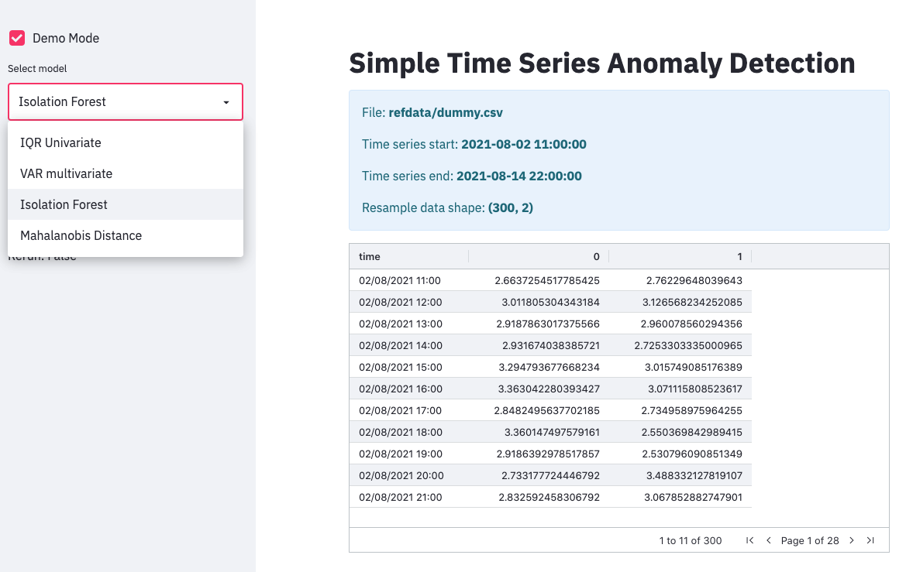
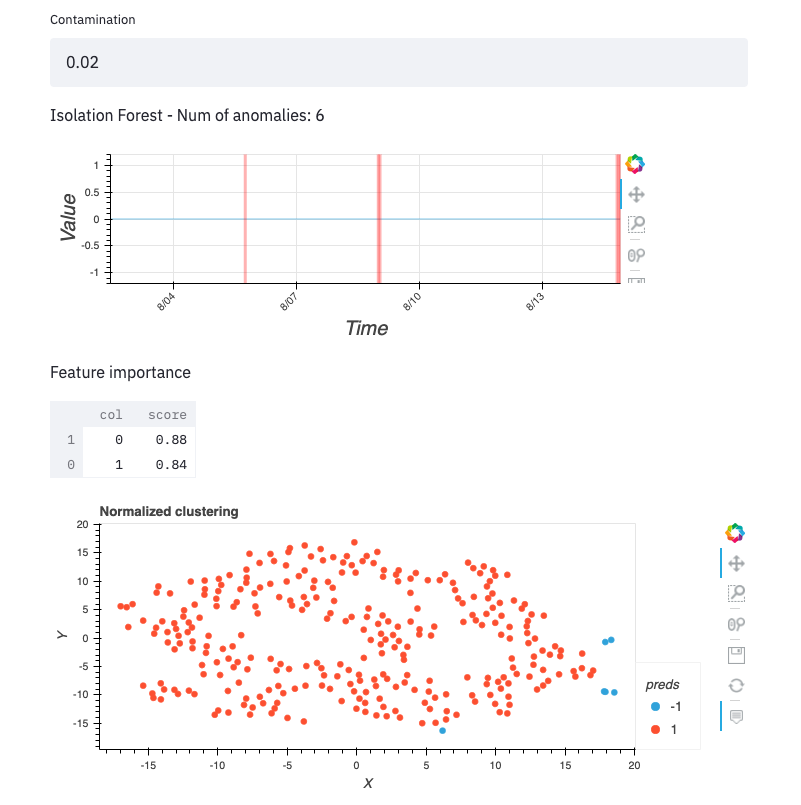

# Simple Anomaly Detection Solution

This is an anomaly detection solution that helps user to quickly identify anomaly in time series data.

In a typical time series analysis use case, this solution provides an easy way to quick analyze a subset of data with anomaly to quickly evaluation a couple of models during exploratory data analysis. This give user a sense of time series data quality and whether there is anomaly pattern in the dataset.

A simple user interface built on top of Streamlit to provide a quick glance on the analysis result.

## Supported Models

- Univariate Inter Quantile Ratio
- Multivariate Vector Auto Regression
- Multivariate Isolation Forest
- Multivariate Mahalanobis Distance

## Usage
This application has been tested with python 3.9.

```bash
git clone https://github.com/yapweiyih/simple-anomaly-detection
cd simple-anomaly-detection

# Activate virtual environment first and install python package, this may take a while, so take a cup of coffee.
pip install -e .
pip install -r requirements.txt

# streamlit run src/uc_timeseries/streamlit_app.py -- --data_dir <path/to/data/>
streamlit run src/uc_timeseries/streamlit_app.py -- --data_dir refdata

```

## Demo

A demo data with some anomaly points has been included to get you familarized with this tool.

### Model Selection

Select desired model to run training and evaluation.



### Evaluation

Visualize time index with anomaly deteceted and feature importance for tree based model.



## Security

See [CONTRIBUTING](CONTRIBUTING.md#security-issue-notifications) for more information.

## License

This library is licensed under the MIT-0 License. See the LICENSE file.
